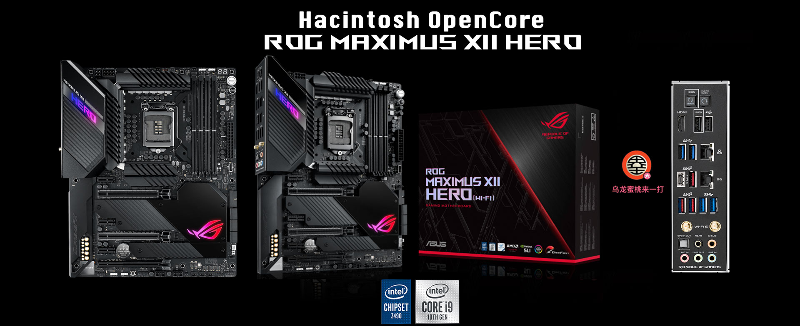

## ROG MAXIMUS XII HERO WiFi Hackintosh OpenCore EFI



### [简体中文](README.zh_CN.md)

### OpenCore

[OpenCore 1.0.0](https://github.com/acidanthera/OpenCorePkg)

### OS Version Tested

- macOS Monterey 12.x
- macOS Ventura  13.x
- macOS Sonoma   14.x 

### Hardware

- Motherboard:  Z490 Chipset
- Bios Version:2701（2023/03/21）
- CPU: Intel i9-10900K
- RAM: CORSAIR 128GB（32GB*4）DDR4 3200MHz
- SSD: 1.KINGSTON SFYRDK2000G MacOS
- SSD: 2.Flashwar SSD W300 Pro 256GB Windows
- iGPU: Intel UHD Graphic 630
- GPU: Sapphire Radeon RX5700XT
- Audio: Realtek ALC1220
- Ethernet Card: Intel L219V
- Ethernet Card: Aquantia AQC111C （Only work for Windows）
- WiFi Card: BCM94360CS2
- CPU Cooling: DEEPCOOL AG620
- PSU: Great Wall GX850 
- Case: JONSBO U4 PLUS

### Notes

 - Use [OCAuxiliaryTools](https://github.com/ic005k/OCAuxiliaryTools) build your SMBIOS

### Bios Setup

```
Advanced

  |-- UEFI Variables Protection
     |-- password protection of Runtime Variables ：Disabled
     
  |-- System Agent(SA)Configuration
     |-- VT-D ：Disabled
     |-- Control Iommu Pre-boot Behavior ：Disable IOMMU
	   
  |--PCI Subsystem Settings
     |-- Above 4G Decoding ：Enabled
     |-- Resize BAR Support ：Disabled
     |-- SR-IOV Support ：Disabled
   
Boot

  |-- Secure Boot
    |-- OS Type ：Other OS
    |-- Secure Boot Mode ：Custom
      
  |-- Boot Configuration
    |-- Fast Boot ：Disabled
      
  |-- CSM (Compatibility Support Module)
    |-- Launch CSM  ：Disabled
```


### Contact Us

 - QQ Group: 23304408

